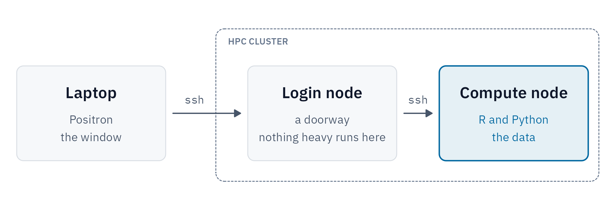
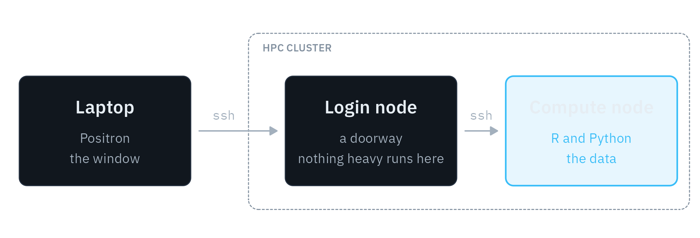

## What is your quest?

In my <a href="../2026-01-21-out-of-bounds-on-purpose-legendry/index.md">last post</a>, I mentioned that I do not like `matplotlib`. I also mentioned that I use Python for a significant portion of my research. Both things are true at once. My machine learning models are written in Python, but most of the work around them happens in R: preparing and editing the input files, previewing the outputs, post-processing the results, generating figures... On any given day I'm moving between the two, often within the same analysis, and I want them to be equal partners rather than feeling like a main language and a guest. I'm hardly unusual in this: as Posit put it when <a href="https://posit.co/blog/positron-product-announcement-aug-2025" target="_blank">announcing Positron</a>, "data teams work in both R and Python, often within the same group" (and, in my case, within the same person). Complicating things further, in my case the models, the input files, and the many thousands of output files they produce all live on a high-performance computing (HPC) cluster.

That leaves me wanting three things from my tools. First, R and Python on equal footing. Second, a proper <abbr title="integrated development environment">IDE</abbr>. Third, to work where my data live, since copying files to my laptop every time I want to look at something was never going to scale, and neither was my laptop. I could do all of this from a terminal, and sometimes I do, but after years of RStudio I like having a console, a plots pane, a list of the objects in my session, a way to look at a data frame without printing it.[^csv] Finding a solution that meets all three of these was a more difficult search than it might seem, but I feel it has finally been solved.

The first of these is where RStudio fell short. For many years it was my go-to IDE, and a lot of my work lived in R Markdown documents. During my PhD, I wrote nearly all of my homework in R Markdown, knitted to PDF through LaTeX. RStudio does support Python: through the <a href="https://rstudio.github.io/reticulate/" target="_blank">`reticulate`</a> package, you can put Python chunks in an R Markdown file, or open a Python console that runs inside your R session. But Python always felt like a guest in R's house. In practice, running Python in R Markdown was a bear, and getting `reticulate` to switch between my conda environments was annoying enough that I gave up on Python chunks fairly quickly. I'm not the only one to notice. Marc Dotson <a href="https://occasionaldivergences.com/posts/positron-intro/" target="_blank">describes</a> Python as "a secondary language" in RStudio, and Mauro Lepore <a href="https://www.ixpantia.com/en/blog/positron-from-rstudio" target="_blank">writes</a> that its Python support "never reached the same level as R support."

Jupyter notebooks could, in theory, solve this too: they run R and Python kernels, and many clusters serve them through a browser. But I've _never_ liked Jupyter---though I've tried maybe a dozen times or more. I prefer RStudio's panes to a single scrolling page, and in R Markdown I can run a whole chunk or step through it a line at a time (which is useful for debugging), where Jupyter runs whole cells and sends single lines off to a separate console.

This post describes the setup I've landed on. With <a href="https://positron.posit.co/" target="_blank">Positron</a> on my laptop as a thin client, I can seemlessly run R and Python running (via a Conda environment) on a compute node on the cluster. You don't need to be using a HPC environment to get something out of it, though. If you use both R and Python, most of this applies wherever your code runs. If your workflow is local, skip ahead to Step 4. If you use a cloud server, skip Step 1.

## Why Positron

Positron is new. It comes from Posit, which until 2022 *was* RStudio: the company <a href="https://en.wikipedia.org/wiki/Posit_PBC" target="_blank">renamed itself</a> that year to signal that its work had grown beyond R, Python included. The RStudio IDE has been around since its first public beta in <a href="https://en.wikipedia.org/wiki/RStudio" target="_blank">February 2011</a>. Positron entered public beta at the end of June 2024 and only <a href="https://positron.posit.co/release-notes/release-2025-07.html" target="_blank">came out of beta</a> in July 2025, a little over a year before I'm writing this. Rather than extending RStudio, Posit built it on Code - OSS, the open-source core of VS Code, bringing over what it calls "all the learnings from the 14+ years of building RStudio." RStudio isn't going away, but Posit's <a href="https://positron.posit.co/faqs.html" target="_blank">FAQ</a> is clear that "the bulk of large-scale, new features will go into Positron."

To be fair to VS Code: you can assemble most of this setup there. The R extension gives you a variables view, a data viewer and a plot viewer, and VS Code's Remote-SSH is excellent. The difference is that Positron comes with all of it built in. Its Variables, Plots, Data Explorer and Help panes work the same way for R and Python. The <a href="https://positron.posit.co/data-explorer.html" target="_blank">Data Explorer</a> also opens CSV, Parquet and Excel files straight from the file explorer, with a small histogram or value counts for each column, which is handy when you have a folder of thousands of model outputs (VS Code can do this with Microsoft's <a href="https://code.visualstudio.com/docs/datascience/data-wrangler" target="_blank">Data Wrangler</a> extension). I can have an R console and a Python console open side by side. It's the RStudio layout without Python support feeling like an afterthought. 

## The setup

There are three machines involved:

::: {.light-content}
{fig-alt="Diagram: Laptop (Positron, the window) connects by ssh to the HPC cluster's login node (a doorway, nothing heavy runs here), which connects by ssh to a compute node (R and Python, the data)."}
:::

::: {.dark-content}
{fig-alt="Diagram: Laptop (Positron, the window) connects by ssh to the HPC cluster's login node (a doorway, nothing heavy runs here), which connects by ssh to a compute node (R and Python, the data)."}
:::

Positron runs on my laptop and draws the interface. Everything else, including the files, the R and Python sessions and the memory they use, lives on the compute node. The login node is only a doorway: nothing heavy runs there, which is how cluster administrators like it.

The examples below assume a cluster that uses Slurm. The names (`login.cluster.example.edu`, `compute-01`, `<partition>`) are placeholders; swap in your own.

### Step 1: Reserve a node

Before connecting, I ask the scheduler for a node. On many clusters this isn't optional: you can only SSH into a compute node while you have a job running on it. I do this from inside `tmux` on the login node:

```bash
tmux new -s node
salloc -p <partition> --nodelist=compute-01 \
  --cpus-per-task=8 --mem=32G --time=12:00:00
# then detach with Ctrl-b d
```

A few notes on this:

- **Why `tmux`?** `tmux` is a "terminal multiplexer": it runs terminal sessions on the remote machine that keep going after you disconnect, and you can reattach to them later from any terminal.[^tmux] An `salloc` allocation lasts only as long as the shell that started it. `tmux` keeps that shell alive after I disconnect, so the node stays mine until the time limit. `tmux attach -t node` brings it back if I want to release the node early. If your cluster has several login nodes behind one address, reconnect to the same one by name, or your `tmux` session won't be there.
- **Why `--nodelist`?** Pinning the node means Positron always connects to the same host name. The trade-off is waiting if that node is busy.
- **How much to ask for?** Whatever your interactive work needs. On a well-configured cluster, your SSH session (and so Positron) is adopted into the job and held to what you requested. Not every cluster gets this right, so stay within your request either way. That's why I match `future`'s workers to it (more on that below).

Check your cluster's policies before you do any of this. Some clusters don't allow long-running processes on login nodes, and some don't allow SSH to compute nodes at all.

### Step 2: Teach SSH the route

The connection from laptop to compute node goes through the login node. SSH can do that hop for you with `ProxyJump`, set in `~/.ssh/config` on the laptop (on Windows, that's `C:\Users\<you>\.ssh\config`; the format is the same, though I've only tested this on a Mac, so <abbr title="your mileage may vary">YMMV</abbr>):

```
# The login node: a doorway only
Host cluster-login
  HostName login.cluster.example.edu
  User <username>
  ServerAliveInterval 60
  ServerAliveCountMax 5

# Compute nodes, reached through the login node
Host compute-*
  User <username>
  ProxyJump cluster-login
  ServerAliveInterval 60
  ServerAliveCountMax 5
  StrictHostKeyChecking accept-new
```

With this in place, `ssh compute-01` takes me straight to the node. The compute node's name has to resolve from the login node, which it normally will. `StrictHostKeyChecking accept-new` saves a prompt the first time you connect to each node, while still refusing to connect if a node's key changes later.[^1]

### Step 3: Connect from Positron

In Positron, open the command palette and run **Remote-SSH: Connect to Host...**, then pick (or type) `compute-01`. The first time, Positron installs its server on the node in `~/.positron-server`. After that, open a folder on the cluster and you're working there: the file explorer, terminals and consoles all live on the node.

Make sure you specify the compute node here, not `cluster-login`. Unlike `tmux`, Positron isn't lightweight: its server, its language tools and your R and Python sessions all run on whichever machine you connect to, and Posit <a href="https://positron.posit.co/remote-ssh.html" target="_blank">recommends</a> at least 4 GB of RAM for real work. Run all that on a login node, which everyone on the cluster shares, and your HPC admins will rain fire down upon you. With `ProxyJump`, the login node only passes the connection along.

These steps were checked with Positron 2026.09.1. The remote machine has to run Linux, and Remote SSH only works in the desktop app.

### Step 4: Get R and Python from conda


<small>Source: <a href="https://xkcd.com/1987/" target="_blank">xkcd</a>, of course[^xkcd]</small>

This is where I had the most trouble. Installing R packages on the cluster kept failing, usually on packages like `sf` and `terra` that link to compiled geospatial libraries (GDAL, PROJ, GEOS). What finally worked was getting R itself from conda. Conda-forge ships R together with those C libraries, built to work with each other, so nothing depends on the cluster's modules or on admin rights.

Many clusters offer Anaconda as a module, but I kept running into dependency and version problems with my cluster's installation. So I installed my own copy of <a href="https://www.anaconda.com/docs/getting-started/miniconda/main" target="_blank">Miniconda</a> in my home directory instead, where I decide what's in it and when it changes.

My environment file looks like this (trimmed):

```yaml
name: myenv
channels:
  - conda-forge
  - nodefaults
dependencies:
  - python=3.12
  - r-base=4.4
  - git
  - gh   # optional: GitHub CLI, for signing in to GitHub from the cluster
  - compilers
  - gdal
  - proj
  - geos
  - udunits2
  - libnetcdf
  - hdf5
  - r-sf
  - r-terra
  - r-arrow
  - r-tidyverse
  - r-data.table
```

Then `conda env create -f environment.yml`. My rule of thumb: let conda install any R package that links to C libraries, and install the rest with `install.packages()` as needed.[^2]

One environment holds both R and Python, and they share a single copy of the geospatial libraries underneath. I install `git` in the same environment too, just like R, so it comes along wherever the environment goes, with no modules to load.

### Step 5: Point Positron at the environment

Positron finds conda environments by itself. For R, it needs one setting, which is off by default. I set it in my User settings, and it applies to remote sessions too:

```json
"positron.r.interpreters.condaDiscovery": true
```

After that, Positron's interpreter picker lists every environment, with its R and Python versions. I pick `myenv` and get a console that reports **R 4.4.3 (Conda: myenv)**. Positron starts R as if the environment were activated, so `library(sf)` finds its libraries:

```
> library(sf)
Linking to GEOS 3.14.1, GDAL 3.13.3, PROJ 9.8.1; sf_use_s2() is TRUE
```

Python needs no setting at all. And because Positron allows several consoles at once, I can have R in one and Python in another, each feeding the same Variables and Plots panes. That's the "equal partners" bit.

There's one more setting, for git. My compute nodes have no system `git`, and Positron's Source Control pane doesn't see the conda environment, so the pane reported that git wasn't installed even though `git` worked fine in the terminal. Pointing Positron at the environment's copy fixes it. This one goes on the **Remote** tab of the settings, since the path only exists on the cluster:

```json
"git.path": "/home/<username>/miniconda3/envs/myenv/bin/git"
```

Use the full path to your environment's `git`.

## What tripped me up

**Positron won't fork R.** Code that used `future::plan(multicore)` worked from a terminal but failed in Positron, with a refreshingly clear error:

```
Can't fork the R session in Positron.
Use a backend that starts fresh R processes instead: PSOCK clusters,
`future::multisession()`, mirai, or `purrr::in_parallel()`.
```

The fix is `plan(multisession)`, which works in Positron and in `Rscript` alike. I also set `workers` to the number of cores I requested, here `plan(multisession, workers = 8)`. `future` normally works that out from the Slurm job, but if Positron's R session isn't part of the job, it may count every core on the node instead. It does mean each worker gets its own copy of the data it needs, so large objects use more memory and can run into `future.globals.maxSize`. One more catch: `parallelly::supportsMulticore()` still returned `TRUE` in Positron for me (parallelly 1.48.0), so it can't be used as a guard. I now use `multisession` unconditionally.

**The server is bigger than you'd think.** Each Positron update installs a new server build on the remote, about 2.2 GB, because the app and server versions must match exactly. Old builds stay behind. If your home directory has a quota, delete the folders in `~/.positron-server/bin/` for versions you no longer use (while disconnected), or move the server elsewhere with the `remoteSSH.serverInstallPath` setting.

**Disconnecting can end your session.** By default, Positron shuts down R and Python as soon as you disconnect. The `kernelSupervisor.shutdownTimeout` setting can keep R and Python running for hours after you disconnect. In a quick test, reconnecting brought back the same session, with everything still in memory.

**Batch jobs need the environment too.** Positron activates the conda environment for you. Scripts you submit with `sbatch` don't get that, and a bare `conda activate` usually fails there because the job's shell hasn't loaded conda. Load it first, then activate:

```bash
# Set up environment
source ~/miniconda3/etc/profile.d/conda.sh
conda activate myenv
```

## Where the scheduler still fits

The Slurm scheduler is still necessary, obviously. Big or parallel jobs still belong in `sbatch` scripts, and my models train as `sbatch` array jobs, in their own conda environment. But I write those jobs using Positron: the shell scripts, and the YAML configs they read, some of which I generate from R. This setup is for the interactive part: exploring data, debugging, making figures, and working through thousands of model outputs where they already live.

## Wrapping up

There you have it: R and Python as equal partners, right where my data live. I'd been after this particular grail for a long time, and I can't tell you what a relief it is to have it working this smoothly. A sincere thank you to the Positron development team.

[^tmux]: New to `tmux`? Ham Vocke's <a href="https://hamvocke.com/blog/a-quick-and-easy-guide-to-tmux/" target="_blank">A Quick and Easy Guide to tmux</a> is a good ten-minute introduction, and this <a href="https://tmuxcheatsheet.com/" target="_blank">cheat sheet</a> covers the keyboard shortcuts. The official <a href="https://github.com/tmux/tmux/wiki/Getting-Started" target="_blank">Getting Started</a> guide goes deeper.

[^csv]: Or at a CSV file without loading it at all: Positron's <a href="https://positron.posit.co/data-explorer.html" target="_blank">Data Explorer</a> opens one straight from the file explorer, which gets filed under "something I didn't even know I needed."

[^xkcd]: Repeat after me: every good blog post contains an xkcd comic.

[^1]: You'll see examples online that use `StrictHostKeyChecking no` with `UserKnownHostsFile /dev/null`. That turns off SSH's check that you're talking to the machine you think you are. If your cluster's nodes are rebuilt often and their keys change, removing the old key with `ssh-keygen -R compute-01` is a safer fix.

[^2]: Compiling these packages from source is where my headaches came from. More on that, and on combining conda with `renv`, in a future post.

<hr>

<small>I do this for fun, but if you enjoyed reading this (without ads!), consider <a href="https://buymeacoffee.com/realmiketalbot">buying me a coffee</a> :coffee:</small>
